### Deep-learning network cloning of human-driving behavior

A Udacity project by James W. Dunn 
January 22, 2017

### Objective
Collect human-driving behavioral data and train a deep learning model to successfully navigate a pair of simulated tracks. Success is defined as: "No tire may leave the drivable portion of the track surface. The car may not pop up onto ledges or roll over any surfaces that would otherwise be considered unsafe (if humans were in the vehicle)." The method involves reducing an input image of the forward view from a vehicle to a single predicted steering angle.

### Data Collection
I began this project by reading through the recommendation list by Paul Heraty. I investigated the Udacity-supplied sample data by importing the images into Adobe Premiere Pro to create a video sequence. This process revealed weaving and "polygonal" driving behavior. Because this project involves behavior cloning, I would prefer a smoother driving experience with less abrupt corrections. I attempted to collect more "steady" driving data by recording laps using a cellular device as a steering wheel (via remote control software). Further, I collected data recorded using keyboard steering input by carefully navigating down the center of the road at a low rate of speed (10-15 mph) through the complete course of both tracks in each direction. I later reasoned that ultimately, all of the imagery would average together into the network parameters. In addition, I captured data using the "fast" graphics quality setting of the simulator to investigate imagery which includes shadows.

### Analysis
Initially, my pipeline preprocessed the input image data as a part of each training cycle. As I increased the number of training cycles, I realized that it would be far more efficient to store the preprocessed data into a serialized file and retrieve it just prior to training. When the model changes or the method of preprocessing is adjusted, I simply delete the data file and rebuild. I also wrote a generator function as an alternate method of retrieving and preprocessing data on demand. This method taxed my CPU-based training system, so I integrated the generator with fetching data from the preprocessed (serialized) data set.

In addition to the Udacity-supplied data set, I experimented with the recordings of additional laps on track 1 and end-to-end runs on track 2. This data did not appear to improve the training. In the end, I opted to utilize the Udacity data solely as it contains sufficient information for adequate training once a viable model is determined and an effective preprocessing pipeline established.

Prior to settling on the present preprocessing pipeline, I performed detailed analysis of certain challenging portions of both tracks, determined by trial and error. In particular, the entrance to the pit stop after the bridge on track 1, the following right turn, and the top of the hill beyond the tunnel/overpass on track 2. I plotted all independent channels of information in the color spaces RGB, YUV, HSV, grayscale, and even a binary (black and white) representation. I have included a sampling of thirteen plots below. In addition, I equalized the histogram of channels to determine the most informative data. Compression artifacts were revealed through this process. I experimented with differing levels of Gaussian blur ahead of applying the Canny filter to several channels.

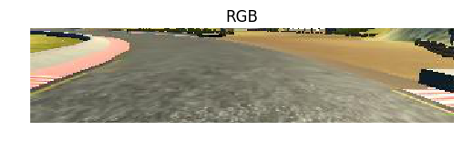
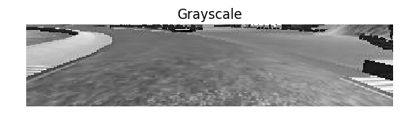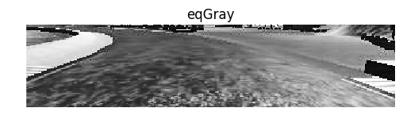
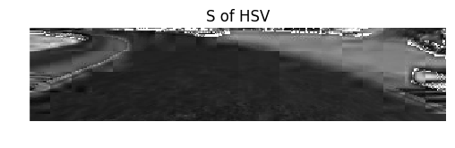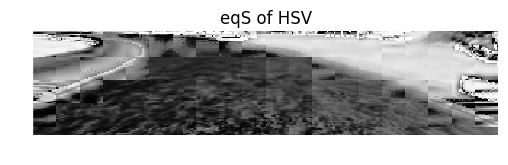
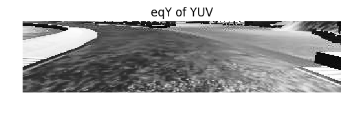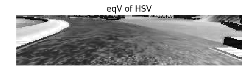
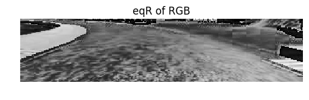
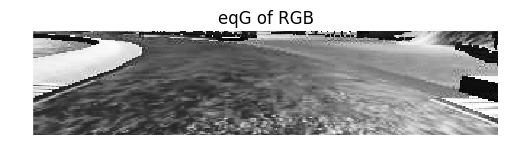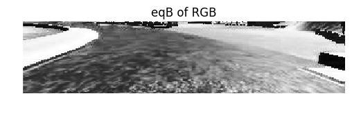
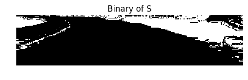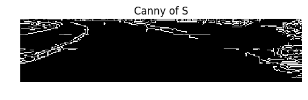

During attempts to stabilize my model performance, I mixed some of the most promising data channels into a customized input stack. For instance: three layers consisting of the saturation channel of HSV, the equalized histogram of the blue channel of RGB, and the Canny of the saturation. Many trials resulted in the vehicle landing in the lake, in the pit stop, or into the roadside blocks or walls on track 2. Most combinations of data channels solve one or two problems, but not all. Ultimately, the winning configuration is a bilinear filter ahead of the singular S channel of HSV.

The preprocessing of the dataset involves use of an index file (CSV format) with a set of metrics captured every 100 milliseconds during the simulated vehicle's drive along a track. The data includes the file names of images from cameras (center, left, right), steering value, throttle, brake, and velocity. The steering values range from -1 (25° left) to +1 (25° right). Given that an average passenger vehicle is just over 180cm wide, I can deduce the three cameras are positioned approximately 90cm apart (horizontal disparity).

Each image is first cropped (removing the top 62 pixels and bottom 26), then blurred slightly and converted to HSV. The S channel is extracted and resized to 18x80. Next the steering value for that image is saved as the training target for the network. Browsing the Udacity driving log file using Excel, I counted 4,360 entries that contain a steering value of zero. Simply removing every other "straight-line" image reduces the dataset dramatically and produces rough thirds of straight and left/right steering. In addition, it makes sense to flip alternating images left-to-right to train the network to neutral (unbiased) steering directions. I noticed that the training data includes a drive in the opposite direction (clockwise) around track 1 which helps to reduce bias. A scatter plot from Excel indicates fairly well-distributed steering values.

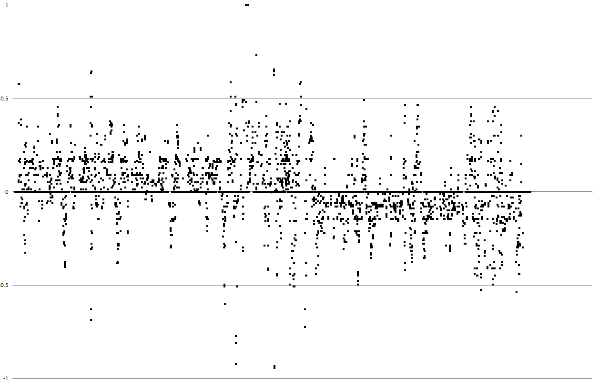

Finally, I make use of the left and right camera images to train the network to move back to the center of the track by offsetting the associated steering value by a small amount. This correction proved to be a difficult number to determine, but through trial and error, I settled on a value of 0.2 (5°). This amount is added to the steering value for the left image (to reinforce the behavior of correcting to the right when the vehicle drifts to the left) and subtracted for the right image. I found that on straight-line driving, any amount was causing an unacceptable weaving effect for low values and jitter for high values, so I conditioned the use of these corrections to be appended to the dataset only when the absolute steering value is greater than 0.15. This has the intended effect of a smoother "analog-style" driving, allowing the vehicle to drift a tolerable amount without the rapid frame-by-frame movement of steering. Jitter is further reduced by averaging the steering values in drive.py which is described in the results section below.

### Architecture
Referring to the recommendation list, I implemented a variant of the Nvidia pipeline as my initial network model. Further, I employed the suggestion to pick three images from the index file, one with a moderate positive steering value, one with negative, and one straight. I used these images throughout my build, train, test cycle as a gauge of effectiveness in training, prior to running the two tracks. After several dives into the lake, I reasoned that if my traffic sign classifier can be effective with 43 classes of signs, why not employ something similar or smaller here since we only need one steering value in the end. I tested several reduced, alternate editions of the model until I arrived at the present simplified version.

The final model consists of 6 layers:
1. Input image value normalization to a range of -1.0 to +1.0
2. A two-dimensional convolution with 20 filters of size 3x12, 'same' padding, rectified linear unit (ReLU) activation, and 2x3 sub-sampling.
3. Max pooling layer with pool size of 2x6, stride of 2x4, and 'same' padding.
4. Dropout of 22% to reduce over-fitting.
5. Flatten layer.
6. Dense layer with 1 node.

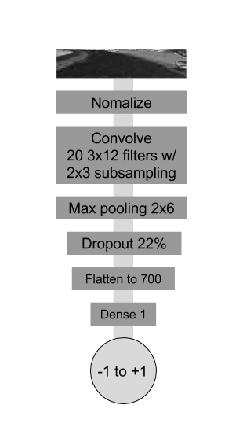
 
I selected the unconventional shapes based on the aspect ratio of the cropped input image 72x320 (rows x columns), resized to 18x80. Keras reports the model summary as follows:

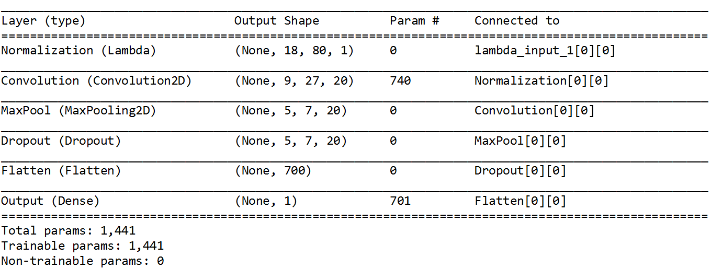

### Training
The model is trained with 8,744 images using the Adam optimizer with the default learning rate and a batch size of 186 (dividing with minimum remainder). I created a halting callback to prevent over-fitting and a model checkpoint to monitor the reduction in error and save only the best weights. 1% of the data is withheld for validation. Final testing is performed in the supplied simulator on both tracks.

In my first week of investigation, training was performed in CPU-mode running Windows 10 on a Xeon W3520 (equivalent to i7 920 generation 1) at 2.8GHz with 6GB memory. I used TThrottle to regulate the Python process when cores exceed 90°C. A few days ago, three components were upgraded: 12GB memory, a 500GB SSD SATA6, and a GTX 1070 GPU. Training cycles went from "minutes-per-epoch" to literally "epochs-per-second", greatly increasing the options for exploring high epoch-count training cycles. This improvement led to automating the optimization process using the Keras callback system. Prior to this, I iterated a single epoch training cycle until I found a validation loss minimum. An experiment log is included below.

### Results
After many failures to complete a lap on track 1, eventually I achieved a balanced model capable of making turns without ending up on a curb. I was exhilarated to find the vehicle still "on track" in the simulator after 100 laps. Despite this small success, staying within the yellow lines on track 1 and navigating track 2 proved to be more challenging. I attempted to provide specific recovery data to handle the difficult areas (especially at the top of the hill following the tunnel/overpass where the model directed the vehicle into the lamp pole). In the end, incorporating the left and right camera data with 5° corrective angles, and increasing dropout from 15% to 22% proved to be the best method. Below is a capture of a processed sequence of images that are input to the network to predict corresponding steering values.

<a href="https://vimeo.com/200627991" width="50%">Link to video 1</a>

To assist with handling corners, I adjusted the driver program (drive.py) to include velocity checking and steering value-based throttle control. If the steering angle is greater than 2.5° and velocity is greater than 18 mph, power is removed to slow the vehicle. If velocity is below 10 mph, full power is applied. This helps with vehicle launch and the inclines of track 2. To dampen the digital jitter of the frame-to-frame predictions by the network, the steering angles  are averaged across 3, 9, and 18 frames. The nearest of three averages or zero is selected by proximity search. This can be likened to a set invisible tracks in the road which the vehicle can select based on drift conditions. As a road bend is traversed, it is intended that the vehicle can dynamically "latch" into the closest matching average of the curve.

I found the most stable on-track performance when the model is trained with greater than 40 epochs. Each complete training cycle produces a different result during testing on both tracks. Sometimes the left turn behavior is weak (swinging too wide) and sometimes the right, leading to a collision with the walls in track 2. At one point, the training cycle (125 epochs) yielded a confident left and right turning behavior, sufficient to pass both test tracks. The fact that different results are produced on each training cycle (due to the random weight assignments at initialization) indicates that this model may not contain a well-defined minimum. I produced 17 trained models capable of performing laps, each with slightly different results, while only two of these are capable of navigating both tracks.

Output listing from the end of a successful training episode: 
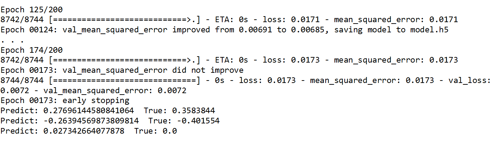
The predicted steering values at the bottom of the output listing above are for sample validation images containing moderate right/left turns and straight-line driving. As mentioned earlier, these values correlate to on-track steering performance.

The following is a link to a video capture of the most successful model navigating both tracks:

<a href="https://vimeo.com/200627815" width="50%">Link to video 2</a>

### Future Directions
1. Train a network model for binocular vision (using a joined left and right image). Dependent on item 1 in simulator upgrades below.
2. Train a committee of models to collectively vote.
3. Collect telemetry data from the best autonomous mode laps on the track and use this as new training data. Perhaps one model teaches another to be a better driver? Dependent on item 1 in simulator upgrades below.
4. Automate the model formulation process to determine an optimal model for this problem. Iterate and dynamically adjust convolution layers, filter counts, kernel sizes, dense layers and sizes, etc.
5. Determine a model with smooth but confident steering. The present amount of steering weave on track 1 can be refined. Explore computational narrowing of the road. 

### Acknowledgements
1.	Paul Heraty recommendations
2.	stackoverflow.com/questions/37293642/how-to-tell-keras-stop-training-based-on-loss-value
3.	keras.io/callbacks
4.	github.com/fchollet/keras/issues/114
5.	Slack channel discussions
6.	Udacity SDC forum
7.	images.nvidia.com/content/tegra/automotive/images/2016/solutions/pdf/end-to-end-dl-using-px.pdf
8.	jacobgil.github.io/deeplearning/vehicle-steering-angle-visualizations
9.	medium.com/udacity/teaching-a-machine-to-steer-a-car-d73217f2492c
10.	chatbotslife.com/using-augmentation-to-mimic-human-driving-496b569760a9
11.	Michael A. Nielsen, "Neural Networks and Deep Learning", Determination Press, 2015
12.	jmlr.org/proceedings/papers/v9/glorot10a/glorot10a.pdf

### Suggestions to Improve the Simulator
1.	Ability to receive center, left, and right images in autonomous mode.
2.	Clickable map of each track.
3.	Mile marker posts to aid with identification of problem areas.
4.	Select a starting point and direction (to save time, rather than repeatedly waiting to arrive at a problem area or manipulating the car into a reverse direction).
5.	Steer by moving the mouse cursor in an area beneath the vehicle (without clicking!).
6.	Ability to programmatically apply brakes in autonomous mode (for downslopes where zero throttle is not sufficient to slow the vehicle).
7.	Blocks on the perimeter of the universe in track 1 to prevent "flying car syndrome".
8.  Rather than roadblocks at each end of track 2, create hairpin turnabouts to allow the vehicle to gently reverse directions on the track (for infinite loop reliability testing). See diagram below.

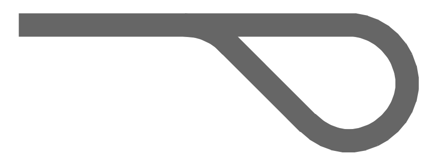

### Project Log
- 20170111: Research and initialization
    - Crop and scale determination
    - Learn more about Keras and generators
    - Additional data collection
    - Color channel inspections
- 20170112: Coding and iterative failures
    - Model A (based on Nvidia model)
    - Attempt 32x32x3 HSV
    - Attempt 32x32x1 V of HSV // fail after bridge.
    - Attempt 42x42x1 version // fail at right turn.
    - Attempt steering angle multiplier and throttle rule
    - Attempt larger filter in 1st conv layer 26,6,6
    - Increase batch size and epoch count // successful lap, but overshooting yellow lines on right turn
    - Record additional data from track 1 and 2
- 20170113: Experimentation and first laps
    - Parameterize load function // ran into pitstop
    - Attempt to simplify model for faster training
    - Model B, less two conv layers and two fc layers
    - Attempt adding .25 as steering value bias to left/right images // fail right turn, but almost make it to the top of track 2
    - Attempt U+J datasets
    - Model C, add 2nd conv layer, 16 epochs // first successful 100 laps, but track 2 fails
- 20170114: Experimentation on track 2
    - Change sub-sampling 2x2 // into pitstop
    - Model D, simplify // into lake on right turn
    - Validation loss lowest at 12 epochs
    - Back to successful laps, try constant throttle at .2
    - Model E, reworked to maintain aspect ratio 18x80x3 // weaving T1, top of T2!
    - Attempt retraining 16 epochs // into lake on right turn
    - Attempt retraining 16 epochs // into pitstop then off world!
    - Record new bottom to top run on T2
    - Model F, reduced on T2 data // crash near the top
- 20170115: Additional analysis
    - Remove LRflip, retrain on U+T2 // laps, crash near top
    - Reinstall LRflip, add more corrective data for turn near top of T2
    - Shorten to 8 epochs // moderate weaving
    - Measured 49.3ms per frame in autonomous mode (fastest 640x480)
    - tan(5°)=90cm/x, thus x=10.287m, so a 5° correction angle results in a 90cm shift (back to center line) over 10.287m of travel
    - At a vehicle rate of 20mph (as reported by the sim) which is 8.94m/s, that shift will be covered in 10.287m/8.94mps or 1.15 seconds or about 23 frames // Is this too much or too little?
    - Analyze images using Adobe Illustrator. Coincidentally, rotating the left and right images by 5° actually aligns the yellow lines to the center image. Interesting, could this help?
    - Attempt rotating left/right images, while maintaining the steering angle
    - Rotation in preprocessing takes too long // failed into a wall on T2
    - Change back to corrective angle mode // still wobbly
    - Additional image plotting and analysis
    - Attempt YUV space // meh
    - Attempt binary filter on blue channel
    - Attempt binary filter on saturation channel
    - Attempt S channel only
    - Attempt 50% dropout // too long to train
    - Attempt Gaussian blur and Canny filter on S channel
    - Attempt mix Canny + HSV to enhance edges // crash second lap, T2 barely!
- 20170116: Hardware upgrade == more epochs
    - Install GTX1070, 12MB, SSD, and tensorflow-gpu
    - Model G, further reduction to six layers, reshaped filters
    - Implement steering value queue - running average over n frames
    - Build iterative training loop, 200 ep // good T1, close calls T2
    - Attempt S/2 + Canny(S)/2 in one layer
    - Attempt 2 layer, S+Canny(S) // weaving T1, crash after tunnel T2
    - Produced excellent quality lapping model track 1
    - Strip out Canny, use S and B in 2 layer // nope
- 20170117: Staying the course
    - Attempt corrective angles of .08, .1, .15, .2, .25, .3 // degrees of weaving
    - Attempt 36x80 input // no change
    - Add blur
    - Back to S only w/ blur, 141 epochs // good T1,T2; record video
    - Relax correction angle to .1
    - Rework the trainer to utilize callbacks
    - Add conditional corrective angle > .1 // ok
    - Increase to .15 // better, less weave
    - Retrain 48 epochs // excellent track 1 and 2
    - Too tired, will record video and back up files tomorrow
- 20170118: Deep learning science
    - Started with a thought to try experimenting with yet smaller models using Jupyter // D'oh! this activity destroyed the last good weights - did not expect the .h5 file to be overwritten
    - Adjustments to stopping callback
    - Without changing the model, perform 17 additional trainings/testings in an attempt to obtain the great results like last evening // frustrating to get different results every time! Sometimes strong left turns, sometimes strong right turns, sometimes weak overall; Inference: the gradient pasture has many puddles
    - One of the training sessions (125 epoch) appears to be successful // good laps on track 1 and and a complete run on track 2; record video; back up files
- 20170119: Code refactoring and cleanup
- 20170120: Write up
- 20170121: One more try...
    - Edit and format for markdown
    - Capture the input images from autonomous mode // noticed the blockiness and determined to try a different filter and a higher resolution configuration
    - Model H, adjust kernels, attempt bilateralFilter+HSV and scale to 72x80, reduce the steering averaging to 2 frames // fail, hugging the curbs for some reason
    - Back to Model G, bilat+S, avg=3 // excellent performance, perhaps more stable than the prior release candidate...record video and back up
    - 9-12% GPU load during drive on T1
    - 17-30% on T2
    - Note: GTX 1070 max performance: 6.5 TFLOPs
    - Perhaps add extreme L/R turn data
    - Attempt tolerance around zero steering angle // better, but polygonal behavior like the original data recordings
- 20170122: Invisible tracks
    - Woke with the idea of a multi-queue
    - Implement short, medium, long queues, findNearest // slightly smoother steering, new video
    - Additional editing of writeup, posting videos, and this document
